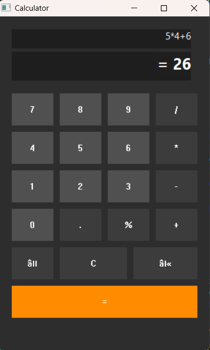

# 🧮 Modern C++ Win32 Calculator

A lightweight, high-performance calculator built with **C++** and **Win32 API**.

## 📂 Project Versions

This repository contains two different implementations of the calculator:

### 1. Win32 API Version (`Calculator_Win32.cpp`)
- **UI:** Modern Windows look with custom colors (Dark mode & Orange button).
- **Features:** Full PEMDAS logic, error handling for division by zero, and Square Root function.
- **Best for:** Learning how to build native Windows desktop applications.

### 2. Graphics.h Version (`Calc_graphics-v.cpp`)
- **UI:** Classic BGI graphics (Old school style).
- **Features:** Coordinate-based button drawing and mouse-click detection.
- **Best for:** Academic projects that require the `graphics.h` library.

  
## ✨ Features
- **PEMDAS Logic:** Correct order of operations (Multiplication before Addition).
- **Custom UI:** Dark mode theme with an orange "Equals" button.
- **Error Handling:** Detects division by zero (Undefined).

## 📸 Preview

## 🚀 How to Run
1. Open the `.cpp` file in Code::Blocks or Visual Studio.
2. Link the `gdi32` and `comdlg32` libraries.
3. Build and Run!

## 🛠️ Built With
- **Language:** C++
- **Framework:** Win32 API
- **Logic:** Shunting-yard Algorithm (Stacks)
